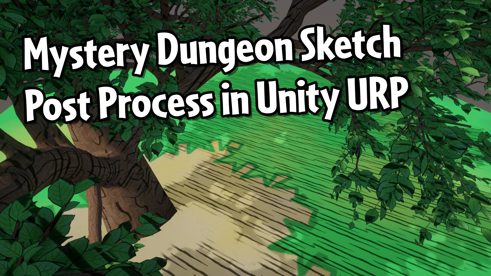

# Mystery Dungeon-style Sketch Effect for Unity URP

A sketched shadows post processing effect based on the effect used in Pokemon Mystery Dungeon: Rescue Team DX.

## Overview

The sketched shadow effect in Mystery Dungeon uses an overlay texture to add detail to the shadows. These sketches overshoot the boundaries of the shadows slightly, so the post process effect in this repository expands the shadowed region using a Gaussian blur which reacts to object boundaries. The sketch texture is then overlaid onto the scene using world position reconstruction with the depth texture, and triplanar mapping with the depth-normals texture.

## Software

This project was created using Unity 2022.3.0f1 (Long-Term Support).

## Tutorials

This project was created as part of a tutorial which is available in the following places:

- [YouTube](https://www.youtube.com/watch?v=h2f05Id8uKc)
- [Article](https://danielilett.com/2024-09-27-tut7-15-mystery-dungeon-sketch-urp/)

## Authors

This project and the corresponding tutorials were created by Daniel Ilett.

## Release

This project was released on September 27th 2024.
